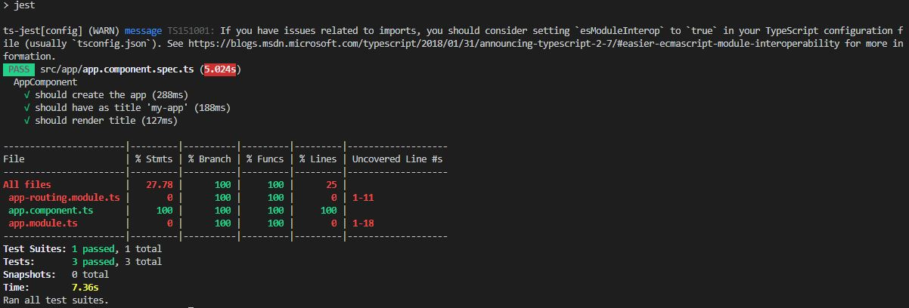

# How to use Jest with Angular

This is just an example about how to configure Angular project to replace Jasmine/Karma by Jest.

## Installation
Install jest related packages:
```console
	npm install -D jest jest-preset-angular @types/jest
```

## Update configuration
Create file ./src/setupJest.ts
```typescript
	import 'jest-preset-angular';
```

Add Jest configuration to package.json file:
```json
	{
		...,
		"jest": {
			"preset": "jest-preset-angular",
			"setupFilesAfterEnv": [
				"<rootDir>/setupJest.ts"
			],
			"verbose": true,
			"collectCoverage": true,
			"collectCoverageFrom": [
				"<rootDir>/src/app/**/*.ts"
			]
		}
	}
```

Note: alternatively, we can create a JavaScript file to configure Jest.

Adjust your testtsconfig.spec.json:
```json
	{
		...,
		"compilerOptions": {
			...,
			"types": [ "jest" ]
			...
		}
	}
```


Adjust your test script: in package.json:
```json
	{
		...,
		"scripts": {
			...,
			"test": "jest",					<--- replace ng test by jest
			"test:watch": "jest --watch",
			"test:coverage": "jest --coverage",
			...
		}
	}
```

Update angular.json file and remove projects.your-project.architect.test section.
Because we have replace the ```ng test``` script by ```jest```, you do not need it anymore.
```json
	"projects": {
		...
		"[your-project]": {
			...
			"architect": {
				...
				"test": { ... }			<--- remove this section
			}
		}
	}
```


## Clean existing configuration
Remove karma related packages:
```console
	npm remove karma karma-chrome-launcher karma-coverage-istanbul-reporter karma-jasmine karma-jasmine-html-reporter
```

Remove jasmine
```console
	npm uninstall jasmine @types/jasmine @types/jasminewd2 jasmine-core jasmine-spec-reporter
```

Remove karma configuration files:
```console
	rm ./karma.conf.js
```

## Run tests

```console
	npm test
```


